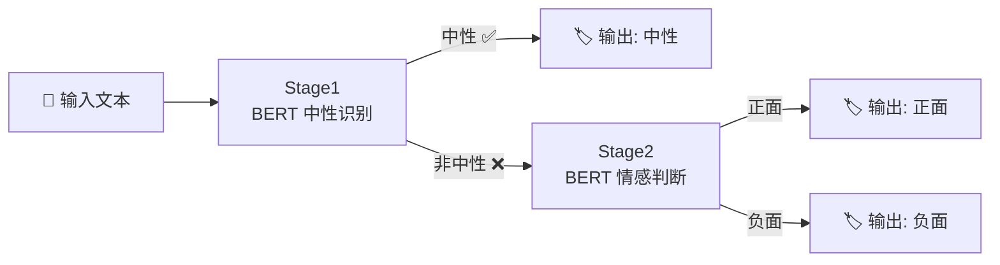

# TriClassSentiment — 基于BERT级联架构的中文三分类情感分析

> 🏷️ **三分类**: 负面 (0) · 中性 (1) · 正面 (2)  
> 🧠 **模型**: `bert-base-chinese` + 两级联（Cascade）架构  
> 🌐 **服务**: Flask Web API + PyQt5 桌面客户端

---

## 📁 项目结构

```
TriClassSentiment/
├── client/                    # PyQt5 桌面客户端
│   ├── main.py                #   GUI 主程序
│   ├── form.ui                #   Qt Designer 界面文件
│   ├── build.spec             #   PyInstaller 打包配置
│   └── runtime_hook.py        #   运行时钩子（torch DLL 修复）
├── data/                      # 原始数据集
│   ├── ChnSentiCorp_htl_all.csv   # 酒店评论（正面/负面）
│   ├── waimai_10k.csv             # 外卖评论（正面/负面）
│   ├── ai_neutral.csv             # AI 生成的中性评论
│   └── neutral_train_strict.csv   # 严格筛选的中性样本
├── processed/                 # 预处理后数据（8:1:1 划分）
├── scripts/                   # 核心代码
│   ├── config.py              #   全局配置中心
│   ├── model.py               #   模型定义（级联架构）
│   ├── preprocess.py          #   数据预处理
│   ├── trainer_utils.py       #   训练工具库
│   ├── train_stage1.py        #   Stage1 训练：中性识别
│   ├── train_stage2.py        #   Stage2 训练：情感二分类
│   ├── evaluate.py            #   模型评估
│   ├── inference.py           #   终端交互式推理
│   └── predict.py             #   批量预测
├── models/                    # 训练好的模型权重
│   ├── stage1_neutral/        #   Stage1：中性 vs 非中性
│   └── stage2_sentiment/      #   Stage2：负面 vs 正面
├── web/                       # Flask Web 服务
│   ├── app.py
│   └── templates/index.html
├── output/cascade_evaluation/ # 评估结果与图表
└── requirements.txt
```

---

## 🧠 核心架构

采用 **两级联（Cascade）** 推理策略，将一个三分类问题分解为两个二分类子任务：



- **Stage1** — `BertBinaryClassifier` 判断文本是否属于中性
- **Stage2** — `BertBinaryClassifier` 对非中性文本做正面/负面二分类
- 两个阶段共享相同的 BERT backbone 结构，但各自独立训练

### 设计动机

中文情感分析中，中性评论往往边界模糊、特征不显著。级联架构将"中性识别"与"正负极性判断"解耦，使每个子模型专注于更明确的目标，从而缓解三分类中中性样本难以学习的问题。

---

## 🚀 快速开始

### 环境要求

- Python ≥ 3.8
- PyTorch ≥ 1.9
- CUDA（可选，CPU 也可运行）

### 安装

```bash
git clone https://github.com/2094780632/BertTriClassSentiment.git
cd TriClassSentiment
pip install -r requirements.txt
```

### 数据预处理

```bash
python scripts/preprocess.py
```

自动完成：合并原始 CSV → 清洗去重 → 8:1:1 分层划分 → 生成 Stage1/Stage2 二分类标签。

### 训练

```bash
# Stage1: 中性 vs 非中性
python scripts/train_stage1.py

# Stage2: 负面 vs 正面（仅非中性样本）
python scripts/train_stage2.py
```

模型将保存至 `models/stage1_neutral/` 和 `models/stage2_sentiment/`。

### 评估

```bash
python scripts/evaluate.py
```

输出：整体 Accuracy / Precision / Recall / F1、混淆矩阵、各类别指标。

### 交互式推理

```bash
python scripts/inference.py
```

在终端输入中文评论，实时输出三分类结果及各分类概率。

---

## 🌐 Web 服务

```bash
python web/app.py
```

启动 Flask 服务后访问：`http://localhost:5000`

| 路由 | 功能 |
|------|------|
| `/` | 单条分析页面 |
| `/batch` | 批量上传预测（CSV/TXT） |
| `/monitor` | 监控面板 |
| `/api/predict` | JSON API：单条预测 |
| `/api/batch` | JSON API：批量预测 |

---

## 🖥️ 桌面客户端

```bash
python client/main.py
```

功能：文本输入分析 · 文件批量导入 · 结果表格展示 · 可视化图表 · 进度条

### 打包为 EXE

```bash
cd client
pyinstaller build.spec
```

---

## 📊 评估结果（酒店评论数据集）

| 指标 | 负面 | 正面 | 中性 |
|------|:----:|:----:|:----:|
| Precision | 0.9173 | 0.9616 | 0.1425 |
| Recall | 0.3245 | 0.6440 | 0.9704 |
| F1-score | 0.4795 | 0.7714 | 0.2485 |
| Support | 2086 | 1865 | 338 |

- **整体准确率**: 51.43%
- 正/负面精确率均 > 90%，但中性召回率极高（97%）而精确率较低
- 说明模型倾向于将模糊样本判为中性，适合"宁中性不漏判"的保守场景

---

## 📦 主要依赖

| 包 | 版本 | 用途 |
|---|------|------|
| `torch` | ≥1.9 | 深度学习框架 |
| `transformers` | ≥4.20 | BERT 模型加载 |
| `scikit-learn` | ≥1.0 | 评估指标 |
| `pandas` | ≥1.3 | 数据处理 |
| `flask` | — | Web 服务 |
| `PyQt5` | — | 桌面客户端 |

---

## 📄 License

本项目仅用于学术研究与课程作业。
